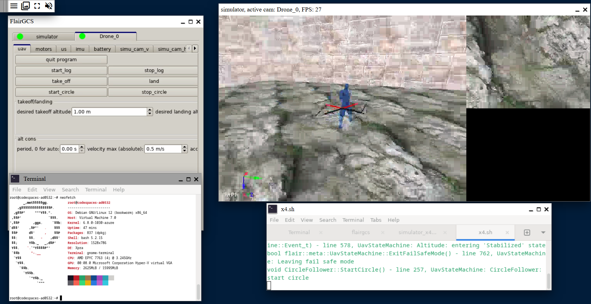
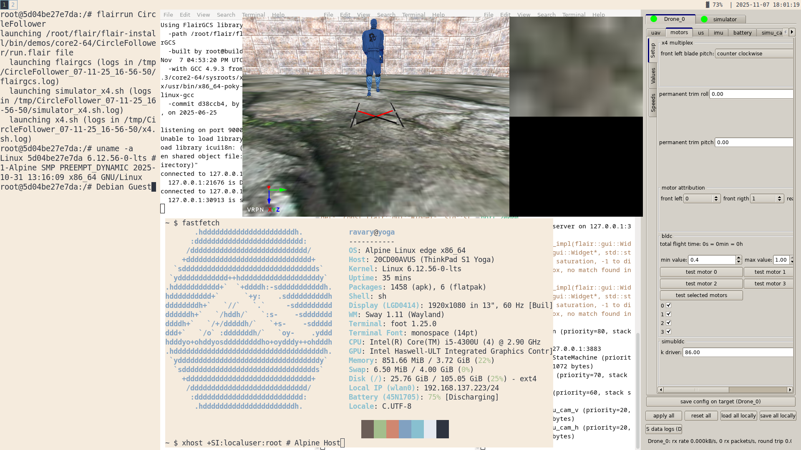

# Flair UTC Codespace (Reproducible Dev Environment with Docker)

FLAIR is an open-source C++ framework developed by the Heudiasyc laboratory from Université de technologie de Compiègne (UTC).
It is designed to assist in the creation of applications for robots, especially UAVs.

This repository helps create reproducible development environments using Docker, so all developers share the same configuration.
It also includes hacks to make it work, since FLAIR is not under active development.

More Info at: 
- UTC GitLab FLAIR wiki: https://gitlab.utc.fr/uav-hds/flair/flair-src/-/wikis/home
- Old (legacy) repository: https://devel.hds.utc.fr/software/flair/wiki

## 1 Build the Image

In the folder where your **Dockerfile** is located, run:

```bash
docker build -t flair-dev -f Dockerfile.hacks .
```

## 2 Run the Container

> [!NOTE]
> If you are on Windows, run this Docker command in a **WSL2 distribution** with **WSLg enabled** (on by default in WSL settings) and integrated with [Docker Desktop](https://docs.docker.com/desktop/features/wsl/#enabling-docker-support-in-wsl-2-distributions)

After building, start the container:

```bash
docker run -it -d --name flair-dev --privileged --env DISPLAY=$DISPLAY --volume /tmp/.X11-unix:/tmp/.X11-unix:rw flair-dev
```
> ⚠️ WARNING: Granting X11 access to root can be a security risk. Only do this in trusted environments.

## 3 Access the Container

Enter the running container:

```bash
docker exec -it flair-dev /bin/bash
```

## 4 Allow GUI Apps (on Host)

Run this **on your host machine** to allow GUI apps from the container:

```bash
xhost +SI:localuser:root
```

## 5 Open in VS Code with Dev Containers Extension

You can open and work directly inside the running container using VS Code’s **Dev Containers** extension:

1. **Install the Dev Containers extension**
   In VS Code, go to **Extensions (`Ctrl+Shift+X`)** → search for **“Dev Containers”** by Microsoft → install it.

2. **Attach to the running container**
   Press `F1` → type **“Dev Containers: Attach to Running Container…”** → select **`flair-dev`** from the list.

3. **Start coding inside the container**
   VS Code will open a new window connected to your container environment.
   You’ll have full terminal, IntelliSense, and extension support inside the container.

Perfect! You can add a **“Demos” section at the end** of your README with GitHub Markdown images using ``. Here’s how it would look:

## Use Case Examples

### Docker + WSL (Windows 10 + Docker Desktop + Debian from Microsoft Store)


### GitHub Codespaces + XPRA (GUI in browser)



### Alpine Linux + Docker (xhost gui passthroug)


